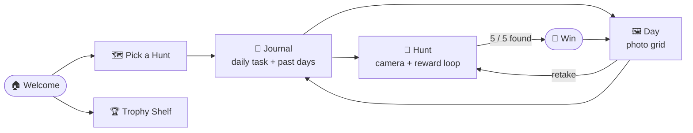

<div align="center">

# 🌿 Nature Explorer 🌸

### *A camera treasure-hunt that turns the world into a playground.*

**Point. Snap. Celebrate.** A joyful, screen-light learning game for kids **ages 3–8** — pick a hunt, walk around finding real things with the camera, and fill a jar of stars with confetti, chimes, and a bouncing mascot. Every photo is kept in a private daily journal, every streak earns a trophy.

<br/>


-3DDC84?style=for-the-badge&logo=android&logoColor=white)


<br/>


</div>

---

## 🌟 Why it's special

> Most kids' apps are *screens*. Nature Explorer sends children **into the real world** — the phone is just the magic lens. It's a mini "Duolingo-for-toddlers": one clear mission, a buttery reward within a second of every find, and a habit loop (daily tasks + streaks + trophies) that quietly builds a photo diary of a child's discoveries.

- 🎯 **One tap = one delight.** Capture → confetti + chime + haptic + a filling star + a mascot bounce, all in ~1s.
- 🧠 **No dead ends by design.** Missing a find never shows a red error — just a gentle *"Hmm, try again!"*.
- 📴 **Works fully offline.** Animated Skia backgrounds, Lottie art, confetti, haptics and springs need **zero bundled binaries**.
- 🔒 **Private by default.** Photos live inside the app's own storage — never dumped into the phone gallery.

---

## 📚 Table of Contents

- [Feature Tour](#-feature-tour)
- [App Flow](#-app-flow)
- [Tech Stack](#-tech-stack)
- [Architecture](#-architecture)
- [Getting Started](#-getting-started)
- [Configuration](#-configuration)
- [How It Works](#-how-it-works-under-the-hood)
- [Troubleshooting](#-troubleshooting)
- [Roadmap](#-roadmap)

---

## 🎮 Feature Tour

### 🕹️ Gameplay
| Feature | What it does |
|---|---|
| **7 themed hunts** | 🌸 Flowers · 🐾 Animals · 🍎 Fruits · 🚗 Vehicles · 🧸 Toys · 📚 Books · 🔌 Gadgets |
| **Activity picker** | A colorful card grid to choose today's hunt |
| **Daily missions** | "Find 5 a day" per hunt — **auto-resets at midnight**, resumes mid-day where you left off |
| **Live camera hunt** | Full-screen preview, a pulsing capture ring, and instant feedback on every snap |
| **Smart recognition** | Optional Google Vision label matching per hunt; stays *generous* when offline so kids never stall |

### 📸 Journal & Memories
| Feature | What it does |
|---|---|
| **Per-hunt journal** | Today's progress card + a browsable list of every past day (Today · Yesterday · dated) |
| **Day view** | A photo grid of exactly what was found on any chosen day — *last day, or 10 days ago* |
| **Retake** | Redo any saved photo; it stays on its original day so the daily count never changes |
| **In-app storage** | Every capture is copied into the app's private album — survives restarts, no permissions needed |

### 🏆 Rewards & Motivation
| Feature | What it does |
|---|---|
| **Reward loop** | Confetti cannon + chime + haptic buzz + star fill + mascot bounce on every find |
| **🔥 Streaks** | "3 days in a row!" — consecutive completed days, computed from the photos themselves |
| **Trophy Shelf** | 15 earnable badges: *First Snap*, per-hunt firsts, *Daily Champ*, *Week Warrior*, *Master Explorer*… |
| **Win celebration** | Full confetti, a Lottie trophy, and a jump straight to today's photos |

### 🎨 Craft & Polish
| Feature | What it does |
|---|---|
| **Springy everything** | Every tappable scales on press; screens fade/slide — never a hard cut |
| **Living backgrounds** | Animated Skia gradients, Ken Burns drift, and softly floating emoji |
| **Minimal back button** | A clean, kid-sized arrow on every screen, safe-area aware |
| **Bulletproof fallbacks** | Lottie → emoji, sound → silent, camera → placeholder — a missing asset never breaks the flow |

---

## 🧭 App Flow



| Screen | Role |
|---|---|
| **Welcome** | Big title, bouncing mascot, "Start the Hunt" + "My Trophies" |
| **Pick** | Choose one of the 7 hunts |
| **Journal** | Today's progress, 🔥 streak, and every past day |
| **Hunt** | The heart — camera, capture ring, stars, and the reward burst |
| **Day** | A grid of one day's photos, each with a Retake button |
| **Win** | Celebration → straight to today's photos |
| **Trophies** | The badge shelf (earned = bright, locked = 🔒) |

---

## 🛠 Tech Stack

| Concern | Library |
|---|---|
| **Framework** | React Native **0.86** (bare CLI) · TypeScript · New Architecture (Fabric) |
| **Camera** | `react-native-vision-camera` **v5** (Nitro) — live preview + `takeSnapshot()` |
| **Recognition** | Google Cloud Vision **LABEL_DETECTION** → per-hunt keyword match |
| **Storage** | `react-native-fs` — app-private album, date-encoded filenames |
| **Motion** | `react-native-reanimated` v4 + `react-native-worklets` + `moti` |
| **GPU visuals** | `@shopify/react-native-skia` — animated gradients + glow ring |
| **Vector art** | `lottie-react-native` — mascot · star burst · trophy |
| **Delight** | `react-native-confetti-cannon` · `react-native-haptic-feedback` · `react-native-sound` |
| **Gestures** | `react-native-gesture-handler` |
| **Navigation** | `@react-navigation/native-stack` (fade / slide transitions) |

---

## 🏗 Architecture

Everything is **data-derived** — there's no database. Each photo is saved as `ne_<hunt>_<timestamp>.jpg`, so hunt, day, daily progress, streaks and badges are all recovered straight from the filenames.

```
src/
├─ App.tsx                 NavigationContainer + native stack
├─ navigation.ts           typed route params
├─ theme.ts                design tokens (colors · spacing · springs)
├─ config/
│  └─ themes.ts            the 7 hunts + keyword sets + helpers
├─ screens/
│  ├─ WelcomeScreen.tsx    start + trophies entry
│  ├─ PickScreen.tsx       hunt chooser grid
│  ├─ JournalScreen.tsx    daily task · streak · past days
│  ├─ DayScreen.tsx        one day's photo grid + retake
│  ├─ HuntScreen.tsx       camera + core reward loop  ★ the heart
│  ├─ WinScreen.tsx        celebration
│  └─ TrophyScreen.tsx     badge shelf
├─ services/
│  ├─ gallery.ts           save / list / group photos · streaks · retake
│  ├─ badges.ts            derive earned/locked badges
│  ├─ vision.ts            Google Vision call + base64 read
│  ├─ sound.ts             audio wrapper (no-ops if absent)
│  └─ haptics.ts           haptic buzzes
└─ components/
   ├─ Background.tsx        Skia gradient · Ken Burns · floaters
   ├─ BackButton.tsx        minimal floating back arrow
   ├─ PillButton.tsx        oversized glowing pill
   ├─ GlowingCaptureButton  Skia pulsing capture ring
   ├─ ProgressStars.tsx     stars that pop as they fill
   ├─ RewardBurst.tsx       confetti + chime + haptic bundle
   ├─ PressableScale.tsx    spring-on-press wrapper
   └─ LottieSafe.tsx        Lottie with emoji fallback
```

---

## 🚀 Getting Started

### Prerequisites
- **Node.js ≥ 20**, **JDK 17**
- **Android Studio** + SDK (Platform 36, Build-Tools 36)
- A **real Android device** is recommended — this is a camera app
- [React Native environment setup](https://reactnative.dev/docs/set-up-your-environment)

<details>
<summary><b>1 · Install</b></summary>

```bash
git clone https://github.com/Mehulbirare/Nature-Explorer.git
cd Nature-Explorer
npm install
```
</details>

<details>
<summary><b>2 · Generate the two binary artifacts</b> (not shippable in source)</summary>

**Gradle wrapper:**
```bash
cd android && gradle wrapper --gradle-version 8.14.3 && cd ..
```

**Debug keystore** (signs debug + demo release):
```bash
keytool -genkeypair -v -storetype PKCS12 \
  -keystore android/app/debug.keystore \
  -alias androiddebugkey -keyalg RSA -keysize 2048 -validity 10000 \
  -storepass android -keypass android \
  -dname "CN=Android Debug,O=Android,C=US"
```
</details>

<details>
<summary><b>3 · (Optional) Google Vision key</b> for real recognition</summary>

- Enable **Cloud Vision API** in a Google Cloud project and create an API key.
- Paste it into [`src/services/vision.ts`](src/services/vision.ts) → `VISION_API_KEY`.
- Free tier = 1,000 label units/month. **Without a key, capture stays generous** so nothing stalls.
</details>

### Run

```bash
npm start            # Metro (keep running)
npm run android      # build + install on device/emulator
```

### Build an APK

```bash
npm run apk:debug    # android/app/build/outputs/apk/debug/app-debug.apk
npm run apk:release  # android/app/build/outputs/apk/release/app-release.apk

adb install -r android/app/build/outputs/apk/debug/app-debug.apk
```

---

## ⚙️ Configuration

### ➕ Add a new hunt (one object!)
Drop an entry into `HUNTS` in [`src/config/themes.ts`](src/config/themes.ts) — a new card appears in the picker and it's instantly playable end-to-end:

```ts
insects: {
  id: 'insects',
  title: 'Bugs',
  targetLabel: 'bug',
  emoji: '🐞',
  missionText: 'Find 5 bugs',
  color: '#8AB17D',
  goal: 5,
  matchKeywords: ['insect', 'bug', 'beetle', 'ant', 'butterfly', 'ladybug'],
},
```

### 🎨 Optional asset drop-ins (extra polish)
| Asset | Where | Notes |
|---|---|---|
| 4K backgrounds | `src/assets/backgrounds/` | Free from [pexels.com](https://pexels.com); pass `image={...}` to `<Background>` |
| Rounded font | `src/assets/fonts/` | Fredoka / Baloo 2 `.ttf`, then `npx react-native-asset` |
| Sound FX | `android/app/src/main/res/raw/` | `shutter.mp3` · `chime.mp3` · `fanfare.mp3` · `nudge.mp3` |

Everything degrades gracefully — a missing asset never breaks the build.

---

## 🔬 How it works (under the hood)

**Capture** → `camera.takeSnapshot()` grabs the live preview → saved as a temp JPEG → copied into the app's private `NatureExplorer/` album.

**A find only counts when a photo is actually saved**, so the star count and the on-disk photo count can never drift apart — which keeps daily completion, streaks and journals perfectly consistent.

**Recognition** (if a Vision key is set): the JPEG's labels are matched against the active hunt's keyword set. Offline or keyless, the app stays generous so the game always flows.

**Streaks & badges** are pure functions over the saved photos — no bookkeeping, no way to desync.

---

## 🩹 Troubleshooting

<details>
<summary><b>Every capture says "Hmm, try again"</b></summary>

Ensure you're on the vision-camera **v5** capture path (`takeSnapshot()` — not the old `takePhoto()`), and that camera permission is granted. On devices with no camera the app shows a placeholder instead.
</details>

<details>
<summary><b>Device skipped: <code>minSdkVersion &gt; deviceApiLevel</code></b></summary>

The app targets **API 24 (Android 7.0)**. Lower `minSdkVersion` in `android/build.gradle` if you need older, and make sure the device's ABI is in `reactNativeArchitectures` (`android/gradle.properties`).
</details>

<details>
<summary><b>Other common issues</b></summary>

- **`gradlew` / wrapper jar missing** → run the `gradle wrapper` step.
- **Signing error** → generate the `debug.keystore`.
- **Reanimated error at startup** → `react-native-worklets/plugin` must be the **last** entry in `babel.config.js`, then `npm start --reset-cache`.
</details>

---

## 🗺 Roadmap

- [x] 7 themed hunts + activity picker
- [x] Daily tasks that reset each day
- [x] Per-hunt photo journal + day browsing
- [x] Retake any photo
- [x] Streak counter
- [x] Trophy shelf (badges)
- [x] In-app private photo storage
- [ ] **Collection book** — a "Pokédex" of everything ever found
- [ ] Kid profiles + parent gate
- [ ] Share / export a photo

---

<div align="center">

**Made with 🌱 for little explorers.**

*Point it at real things.*

</div>
